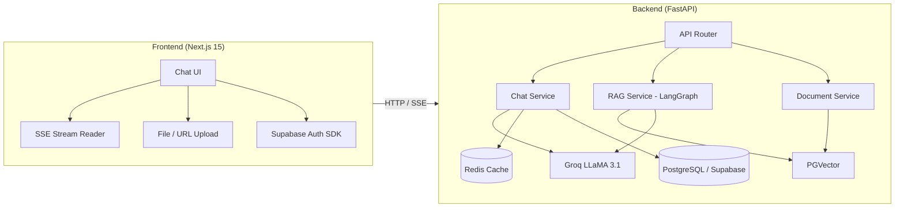

# Document Q&A Chatbot

This is a full-stack AI platform that combines a **Socratic AI Mentor** with **Retrieval-Augmented Generation (RAG)** to deliver context-aware, document-grounded conversations. Upload PDFs, Word docs, or web pages and ask questions — the AI retrieves relevant chunks from your documents and responds with cited answers streamed in real time.

---

## ✨ Key Features

| Feature | Description |
|---|---|
| **AI Mentor Chat** | Socratic-style AI tutor powered by **LLaMA 3.1 8B** (via Groq). Guides learners with hints and questions rather than giving away answers. |
| **RAG Document Q&A** | Upload files (PDF, DOCX, TXT) or paste a URL — documents are chunked, embedded, and stored in **PGVector**. Ask questions and get grounded answers with source citations. |
| **Real-Time Streaming** | Server-Sent Events (SSE) deliver tokens to the UI as they're generated — no waiting for full responses. |
| **Semantic Caching** | Frequently asked questions are cached via **RedisVL SemanticCache** with vector similarity, reducing LLM calls and latency. |
| **Hierarchical Summarization** | Long conversations are automatically summarized in the background to keep context windows efficient while preserving history. |
| **Authentication** | Email/password sign-up, Google OAuth, and password reset — all handled by **Supabase Auth**. |
| **Drag & Drop Uploads** | Drag files directly into the chat or paste a URL to ingest web content. |

---

## 🏗️ Architecture



---

## 🛠️ Tech Stack

### Frontend
| Technology | Purpose |
|---|---|
| [Next.js 15](https://nextjs.org/) (App Router + Turbopack) | React framework |
| TypeScript | Type safety |
| Tailwind CSS 4 | Styling |
| Supabase JS SDK | Authentication (email, Google OAuth) |
| Axios | HTTP client |
| Lucide React | Icons |
| Geist Font | Typography |

### Backend
| Technology | Purpose |
|---|---|
| [FastAPI](https://fastapi.tiangolo.com/) | Python async web framework |
| Groq (`ChatGroq`) | LLM inference — **LLaMA 3.1 8B Instant** |
| LangChain + LangGraph | RAG workflow orchestration |
| HuggingFace Embeddings | `sentence-transformers/all-mpnet-base-v2` |
| PGVector (via `langchain-postgres`) | Vector store for document embeddings |
| PostgreSQL (Supabase) | Chat history, sessions, document metadata |
| Redis | Message caching, Celery broker |
| RedisVL `SemanticCache` | Semantic similarity caching for LLM responses |
| Celery | Background task queue |
| Supabase Auth (service role) | JWT token verification |
| Pydantic v2 | Request/response validation |
| Conda (`rag-genai` env) | Dependency management |

---

## 📂 Project Structure

```
SparkSpace/
├── backend/
│   ├── app/
│   │   ├── api/
│   │   │   ├── routes.py            # Root router + health check
│   │   │   └── rag.py               # RAG endpoints (upload, chat, delete, list)
│   │   ├── auth/
│   │   │   └── supabase_auth.py     # JWT verification via Supabase
│   │   ├── core/
│   │   │   ├── config.py            # Pydantic settings (env vars)
│   │   │   ├── connections.py       # DB pool, Redis, LLM, embeddings, vector store
│   │   │   └── constants.py         # Chunk size, cache TTL, batch sizes
│   │   ├── models/
│   │   │   └── schemas.py           # Pydantic models (MessageRequest, RAGState, etc.)
│   │   ├── services/
│   │   │   ├── chat_service.py      # Chat chain, summarization, SSE streaming
│   │   │   ├── rag_service.py       # LangGraph RAG: retrieve → generate
│   │   │   └── db.py                # MongoDB (Motor) client
│   │   ├── tasks/
│   │   │   └── sample_task.py       # Celery task definition
│   │   ├── utils/
│   │   │   ├── cache_service.py     # Redis caching & semantic cache ops
│   │   │   ├── database_service.py  # PostgreSQL CRUD for sessions & messages
│   │   │   └── document_service.py  # File loading, chunking, embedding, metadata
│   │   └── main.py                  # FastAPI app entry point
│   ├── celery_worker.py             # Celery worker launcher
│   └── environment.yml              # Conda environment definition
├── frontend/
│   ├── app/
│   │   ├── ai-mentor/page.tsx       # AI Mentor page (renders Chat component)
│   │   ├── signup/page.tsx          # Sign-up page
│   │   ├── reset-password/page.tsx  # Password reset page
│   │   ├── components/
│   │   │   ├── chat.tsx             # Main chat UI (messages, uploads, streaming)
│   │   │   ├── login-modal.tsx      # Login modal (email + Google OAuth)
│   │   │   └── navigation.ts        # Client-side routing hooks
│   │   ├── layout.tsx               # Root layout (Geist fonts)
│   │   ├── page.tsx                 # Landing / home page
│   │   └── globals.css              # Global styles
│   ├── lib/
│   │   └── supabaseClient.ts        # Supabase browser client
│   ├── public/                      # Static assets (SVGs, images, fonts)
│   └── package.json
├── table.sql                        # PostgreSQL schema (4 tables)
└── README.md
```

---

## 🗄️ Database Schema

Defined in [`table.sql`](table.sql) — four PostgreSQL tables hosted on Supabase:

| Table | Purpose |
|---|---|
| `user_documents` | Uploaded document metadata (filename, hash, chunk count, session/user linkage) |
| `ai_chat_history` | JSONB message log (`human` / `ai` / `system` with content) |
| `chat_session` | Session tracking per user (active flag, summary, timestamps) |
| `chat_summaries` | Running conversation summaries for hierarchical memory |

---

## 🏁 Getting Started

### Prerequisites

- **Python 3.10+** (Conda recommended — env name: `rag-genai`)
- **Node.js 18+**
- **Redis** (local or cloud)
- **Supabase** project (for PostgreSQL + Auth)
- **Groq API key** ([console.groq.com](https://console.groq.com))

### 1. Clone & Configure

```bash
git clone <repo-url>
cd SparkSpace
```

Create **`backend/.env`**:

```env
GROQ_API_KEY=your_groq_key
SUPABASE_URL=https://your-project.supabase.co
SUPABASE_DB_URL=postgresql://...
SUPABASE_SERVICE_ROLE_KEY=your_service_role_key
MONGO_URI=mongodb://localhost:27017
REDIS_URL=redis://localhost:6379
```

Create **`frontend/.env.local`**:

```env
NEXT_PUBLIC_BACKEND_URL=http://localhost:8000
NEXT_PUBLIC_SUPABASE_URL=https://your-project.supabase.co
NEXT_PUBLIC_SUPABASE_ANON_KEY=your_anon_key
```

### 2. Database Setup

Run [`table.sql`](table.sql) in your Supabase SQL editor to create the required tables.

### 3. Backend Setup

```bash
cd backend

# Option A: Conda (recommended)
conda env create -f environment.yml
conda activate rag-genai

# Option B: pip
python -m venv venv
venv\Scripts\activate        # Windows
source venv/bin/activate     # macOS/Linux
pip install -r requirements.txt  # if available

# Start the API server
uvicorn app.main:app --reload
```

### 4. Frontend Setup

```bash
cd frontend
npm install
npm run dev
```

Open **[http://localhost:3000](http://localhost:3000)** to use the app.

### 5. (Optional) Celery Worker

```bash
cd backend
celery -A celery_worker worker --loglevel=info
```

---

## 🔄 How It Works

### Chat Flow
1. User sends a message → frontend calls `/api/chat` with SSE.
2. Backend retrieves **conversation context** (last *K* messages + running summary from Redis).
3. Checks **semantic cache** — if a similar question was asked recently, returns cached response instantly.
4. On cache miss, streams tokens from **Groq LLaMA 3.1** via LangChain.
5. After streaming completes, saves messages to **PostgreSQL** and **Redis cache**.
6. Background task checks if summarization is needed (every *SUMMARY_BATCH_SIZE* messages).

### Document Q&A Flow
1. User uploads a file or URL → backend chunks the document with `RecursiveCharacterTextSplitter`.
2. Chunks are embedded using **all-mpnet-base-v2** and stored in **PGVector**.
3. When the user asks a question with documents selected, the **LangGraph RAG pipeline** runs:
   - **Retrieve** → similarity search over the user's documents in PGVector.
   - **Generate** → LLM answers using retrieved context with source citations.

---

## 📜 License

This project is for educational and personal use.
